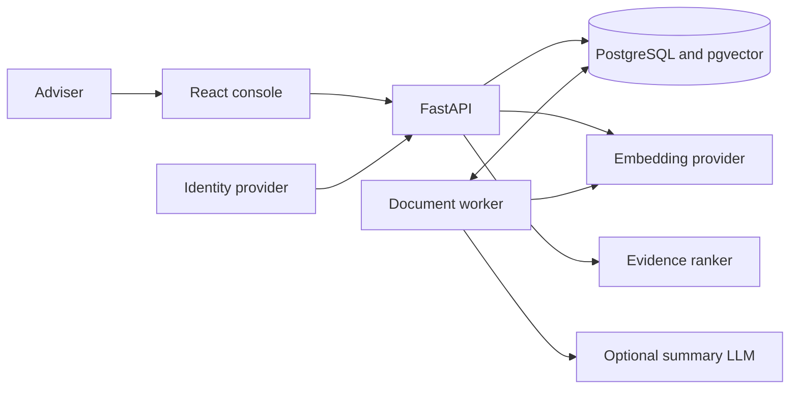

# Understand the architecture

Nevis is a modular monolith for tenant-authorised client and document search. FastAPI serves the API and React console. PostgreSQL stores application data, jobs, search indexes, and vectors. One worker indexes and summarises document versions.

## System shape

The API and worker share one Python codebase and domain model. PostgreSQL is the source of truth. Model providers are replaceable dependencies behind worker interfaces.

## Design choices

| Choice | Not this | Why |
| --- | --- | --- |
| One Postgres with pgvector | Separate vector DB or search cluster | Tenant filter, full-text, and vectors stay in one transaction at this scale |
| Exact scan of authorised chunks | Global ANN, then filter | Isolation first; ANN only if search misses the 800 ms p95 |
| Lexical + vector + MiniLM | A single embedding cut-off | For `address proof`, BGE-small ranked an address-change note above a utility bill |
| MiniLM L6 reranker | BGE-reranker-base | Same ordering; ~0.5 s vs ~11 s on CPU |
| Named degraded modes | Fail closed on every model blip, or hide the miss | TEI down → `lexical_degraded`; reranker down → `hybrid_unreranked`; DB/audit still 503 |
| Source snippets, no generated answers | RAG chatbot | The brief is find-the-passage, not write-an-answer |
| Client fields stay in Postgres | Send client records to the embedder | Documents and queries may leave; names and emails do not |
| `/v1` writes, `202` ingest, search envelope | Brief’s unversioned `/clients`, `201`, and bare result array | Indexing is async; `/search` stays the brief path; `mode`, cursor, and provenance need a named object |

[Search engine](search-engine.md) has the bake-off numbers. [Scale constraints](scale-constraints.md) says when to reopen ANN.

## Trust boundaries

These rules define the architecture:

- Authenticate the adviser and authorise one tenant before reading or changing data
- Apply the tenant filter before counting, ranking, or returning records
- Create each document version and indexing job in one transaction
- Claim worker jobs through durable database leases
- Send document chunks, but never client records, to model providers
- Keep client text, document text, raw queries, vectors, and credentials out of logs and audit events
- Change the deployment shape only after a measured limit

The [OpenAPI contract](../openapi.json) defines HTTP. [OpenSpec](../openspec/specs/) defines observable behavior. The task guides explain [clients](clients.md), [documents](documents.md), [search](search-engine.md), and [operations](runbook.md).
