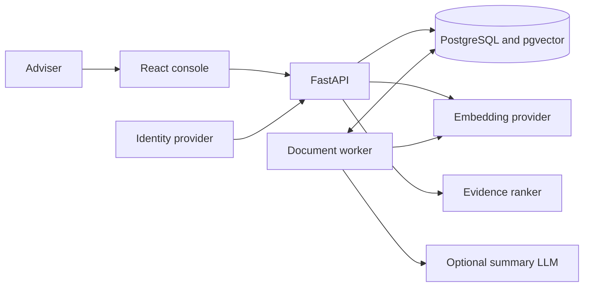

# Understand the architecture

Nevis is a modular monolith for tenant-authorised client and document search. FastAPI serves the API and React console. PostgreSQL stores application data, jobs, search indexes, and vectors. One worker indexes and summarises document versions.

## System shape

The API and worker share one Python codebase and domain model. PostgreSQL is the source of truth. Model providers are replaceable dependencies behind worker interfaces.

## Trust boundaries

These rules define the architecture:

- Authenticate the adviser and authorise one tenant before reading or changing data
- Apply the tenant filter before counting, ranking, or returning records
- Create each document version and indexing job in one transaction
- Claim worker jobs through durable database leases
- Send document chunks, but never client records, to model providers
- Keep client text, document text, raw queries, vectors, and credentials out of logs and audit events
- Change the deployment shape only after a measured limit

The [OpenAPI contract](../openapi.json) defines HTTP. [OpenSpec](../openspec/specs/) defines observable behavior. The task guides explain [clients](clients.md), [documents](documents.md), [search](search-engine.md), and [operations](runbook.md).
