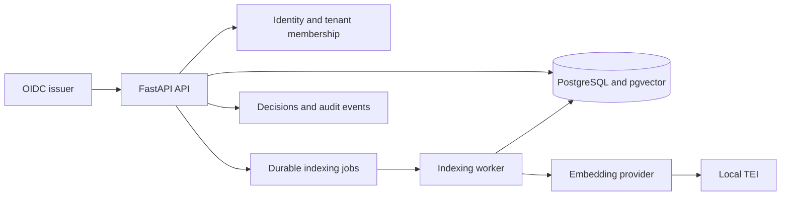

# Architecture

Nevis is a modular Python monolith. FastAPI owns HTTP contracts, application services own
transactions, domain modules own provider-neutral rules, PostgreSQL owns durable state and
retrieval, and a separate worker consumes durable indexing jobs.



## Trust and authorisation

OIDC deployments verify tokens from one configured issuer and map the verified `sub` to an
advisor. Each request also names a tenant. PostgreSQL membership—not token tenant or role
claims—decides access.

The application records one allow or deny decision before a protected operation. Every
search branch receives the authorised tenant ID and filters in SQL before scoring, ranking,
pagination, or result construction. This invariant is more important than the retrieval
algorithm:

```text
authenticate → authorise and record → retrieve within tenant → rank → audit
```

## Data and indexing

Clients belong to a tenant. Their normalised email is unique within that tenant. New
documents belong to one client; migrated legacy documents may have no client. Document
versions and embedding profiles are immutable.

The API writes a document version and its indexing job in one transaction. The worker claims
jobs with `FOR UPDATE SKIP LOCKED`, creates deterministic chunks, embeds them through the
active profile, and records completion or a safe failure code. Retries use content hashes and
stable version/profile identities.

Every searchable document follows this lineage:

```text
tenant → client? → source → document → version → embedding profile
       → indexing authorisation decision → search authorisation decision
```

Client results retain the tenant, client, creation decision, and search decision.

## Embedding providers

The domain depends on a small contract:

```python
class EmbeddingProvider(Protocol):
    profile: EmbeddingProfile

    async def embed_documents(self, texts: list[str]) -> list[list[float]]: ...
    async def embed_query(self, text: str) -> list[float]: ...
    async def healthcheck(self) -> ProviderHealth: ...
```

`LocalTEIProvider` is the reproducible default. `DeterministicFakeProvider` makes automated
tests stable and network-free. Hosted providers can implement the same contract when a
deployment needs one. Provider or model changes create a new immutable profile and require a
controlled re-index; they never overwrite vectors in place.

## Retrieval and ranking

`mixed-rrf-v1` uses three precedence bands:

1. Exact normalised client email.
2. Exact case-insensitive client full name.
3. General client and document candidates.

The general band combines client lexical, document lexical, and document semantic branch
positions with weighted reciprocal-rank fusion. It does not compare PostgreSQL text rank
directly with cosine similarity. Result type and stable UUID break ties.

The API returns a discriminated client/document result list. Signed cursors bind the query,
tenant, active profile, retrieval mode, ranking version, ordering values, and issue time.
When query embedding fails, lexical client and document retrieval remains available as
`lexical_degraded` mode.

## Reproducibility and privacy

Dependencies, the local model revision, chunking, thresholds, and ranking are versioned.
Tests use fixed fixtures and the fake provider; real-TEI evaluation is an explicit gate.
Structured logs and audit records contain bounded IDs, fingerprints, ranks, outcomes, modes,
and timings. They do not contain client text, document text, raw queries, vectors, cursor
payloads, token claims, or credentials.

Langfuse or OpenTelemetry may receive redacted traces later. Neither is an authorisation
source, audit store, business database, or reproducibility mechanism.

## Measured envelope

Measurements below come from the 2026-08-16 Apple Silicon local environment.

| Check | Result | Target |
| --- | ---: | ---: |
| Warm mixed API search | p95 68.75 ms | p95 below 800 ms |
| Representative 100,000-document repository query | p95 683.40 ms | p95 below 800 ms |
| Real-TEI labelled relevance | Recall@5 1.0; MRR 1.0 | versioned suite passes |

A deliberately broad query matching 50% of 100,000 documents measured p95 1.93 seconds.
We accept that risk for development only through 2026-09-15. It blocks a wider rollout if
representative traffic or a materially larger corpus misses the 800 ms objective. Before
adding distributed infrastructure, evaluate PostgreSQL partitioning, current-version
denormalisation, ANN behaviour under tenant filters, and broad-match lexical plans.
