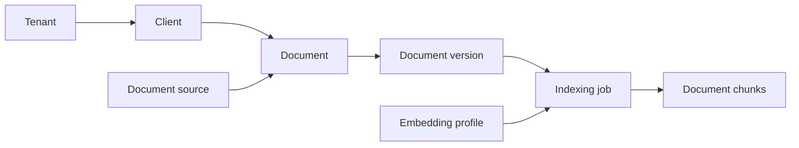

# Understand document processing

Every document belongs to one client. Content changes create immutable versions. A durable worker indexes versions and creates optional summaries.

## Follow version lineage



| Record | Purpose |
| --- | --- |
| `document_sources` | Identify a source within one tenant |
| `documents` | Store stable identity, client, source, external ID, and current title |
| `document_versions` | Store immutable content, hash, version number, and ingestion decision |
| `ingestion_requests` | Make ingestion safe to retry within a tenant |
| `indexing_jobs` | Track work for one version and embedding profile |
| `document_chunks` | Store text ranges, lexical indexes, vectors, and lineage |
| `embedding_profiles` | Version model, dimensions, normalisation, chunking, and pipeline |

Every document requires a client. Tenant, source, and external document ID identify one stable document, and a document never moves to another client.

## Respect document limits

| Value | Limit |
| --- | ---: |
| Source reference | 200 characters |
| External document ID | 255 characters |
| Title | 500 characters |
| Plain-text content | 500,000 characters |
| Idempotency key | 255 characters |
| Client document page | 25 by default, 100 maximum |
| Page cursor lifetime | 15 minutes by default |
| Version history | Latest 200 versions |

The content limit is an API bound, not a latency target: larger documents create more sequential embedding requests and hold one indexing transaction open longer.

## Ingest a document

Ingestion runs in one transaction:

1. Record the authorisation decision
2. Confirm the client belongs to the authorised tenant
3. Normalise and fingerprint the request
4. Replay a matching idempotency request or reject a conflict
5. Find or create the source and stable document
6. Reuse identical current content or create the next version and indexing job
7. Store the audit event and commit

The API returns `202`. A revision reuses the document’s client, source, and external ID; it creates a new version and never edits older content.

## Index a version

The worker claims queued jobs with `FOR UPDATE SKIP LOCKED`, and a lease allows recovery after interruption.

It splits normalized text into 1,000-character windows with 200-character overlap, sends at most 32 chunks per embedding request, collects every vector, then stores offsets and hashes and completes the job. Version, profile, and ordinal keys make retries idempotent, so a provider failure leaves no partial chunks.

Missing lineage, profile mismatch, or provider failure records a safe failure code. The worker never creates another version to hide failure.

Failed indexing is terminal in this release, with no supported requeue command. For disposable local or fictional UAT data, fix the cause, reset the stack data, and reseed. Do not edit job rows or create a replacement version to conceal the failure.

Search uses completed jobs for each document’s latest version, so a new version drops the old one from results until indexing completes.

## Summarize a version

With summaries enabled, ingestion creates one summary job per new version. The worker sends bounded fictional content to the configured LLM provider and stores validated output — see [Model providers](model-providers.md) for the setup and data boundary.

The API reports `not_requested`, `pending`, `processing`, `ready`, or `failed`; only `ready` includes summary text. Summary failure never blocks indexing or document access.

## Read documents

The API exposes these authorised views:

- Client document timeline
- Current document state
- Editable current content
- Version history
- Version-specific content and indexing state

Timeline queries use keyset pagination. Version history is newest first and limited to 200 entries.

Every query includes the authorised tenant, and unknown and cross-tenant records return the same `404`. Responses retain the decisions needed to trace ingestion and retrieval.

## Protect content and lineage

The embedding provider can receive document chunks, but never client fields. Logs, metrics, and audit metadata exclude content, vectors, credentials, and idempotency keys.

Every chunk retains tenant, source, document, version, embedding profile, and ingestion decision. [Search engine](search-engine.md) adds the search decision to returned results.

## Verify the lifecycle

The focused suites cover replay, conflict, immutable revisions, tenant isolation, lineage, worker recovery, and provider failure:

```bash
uv run pytest tests/integration/test_ingestion_api.py \
  tests/integration/test_ingestion_pipeline.py
```

OpenSpec records the [ingestion](../openspec/specs/document-ingestion/spec.md), [indexing](../openspec/specs/document-indexing/spec.md), and [retrieval](../openspec/specs/document-retrieval/spec.md) contracts.
