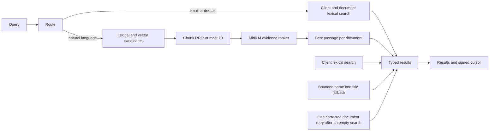

# Understand search results

Nevis searches clients and document evidence through `mixed-rrf-v5`. It ranks records that match the query, not documents that merely belong to a matching client.

## Search limits

| Value | Current Compose | Host validation ceiling |
| --- | ---: | ---: |
| Query length | 500 characters | 2,000 characters |
| Results per page | 20 by default, 50 maximum | 200 maximum |
| Cursor lifetime | 15 minutes | 24 hours |
| Evidence-ranker candidates | 10 | 100 |
| Returned document snippet | 280 characters | 2,000 characters |

The Compose `.env` overrides no search settings. A cursor is bound to its tenant, query, ranking version, and page position.

## Search flow

The router selects literal or natural-language retrieval, then combines typed results.



Every branch filters tenant, authorisation, current version, and active embedding profile before scoring or limiting rows.

## Route identifier queries

A complete email or domain, such as `john.doe@neviswealth.com` or `neviswealth.com`, uses literal search and skips embedding and reranking. A document appears only when its own title or content matches; client ownership is lineage, not evidence.

Ambiguous input, such as `NevisWealth`, `ada@exam`, or prose with a decimal, uses natural-language retrieval. The deterministic router does not infer intent.

## Rank natural-language evidence

PostgreSQL full-text search and BGE-small embeddings retrieve chunks, weighted reciprocal rank fusion selects at most 10 candidates, and the pinned `cross-encoder/ms-marco-MiniLM-L6-v2@c5ee24c` model scores each query and candidate together.

The vector floor of `0.60` limits candidate work; the MiniLM floor of `0.005` controls final evidence. Each document keeps its highest-scoring chunk. Exact client email and full-name matches outrank general results.

This second stage fixes a measured embedding error: for `address proof`, BGE-small scored an address-change negative at `0.6647` above a utility-bill positive at `0.6240`, so no single vector threshold can accept the positive and reject the negative.

## Recover specific misspellings

When a client or document lexical family is empty, trigram indexes may contribute full-name or title matches above the `0.5` strict-word-similarity floor. These occupy the lowest match band and the console labels them as suggestions. Complete emails and domains stay literal, and document content stays whole-term.

If an ordinary natural-language search returns nothing, Nevis may correct only its final token — which must be alphabetic, at least five characters, absent from the local dictionary, and have one unique highest-frequency candidate at edit distance one. Retrieval then runs once more with the corrected query, so `investment opportunit` may retry as `investment opportunity`.

The submitted query stays authoritative for client matching, display, cursor binding, authorization, audit, and telemetry. Corrected text is neither returned nor recorded. Successful searches and complete identifiers are never rewritten, and cursors from older ranking versions are invalid.

## Return source evidence

Document results reuse source text:

- Literal and lexical results return a bounded match window
- Reranked results return the winning chunk within the snippet limit
- Client results never expose document content

Nothing is generated. Every passage remains attributable to stored content.

## Report degraded modes

Search reports the path used for each page:

| Mode | Meaning |
| --- | --- |
| `hybrid` | Natural-language retrieval and evidence ranking completed |
| `lexical_identifier` | A complete email or domain used literal retrieval |
| `hybrid_unreranked` | Authorised candidates returned without evidence ranking |
| `lexical_degraded` | Query embedding failed and only lexical branches ran |

Database, authorisation, and audit failures return no partial page. The evidence ranker is optional because its degraded mode is explicit.

## Measure search changes

The seeded evaluation set covers identifiers, paraphrases, hard negatives, nonsense, and required ordering. It measures candidate Recall@10 separately from final Precision@5, Recall@5, mean reciprocal rank (MRR), normalized discounted cumulative gain at 10 (NDCG@10), empty results, and p95 latency.

The CPU bake-off selected MiniLM:

| Model | Quality | CPU latency |
| --- | --- | ---: |
| MiniLM L6 | Correct ordering across utility bill, address change, and investment evidence | p95 `488.93 ms` for 9 candidates |
| BGE reranker base | Correct ordering | p95 `11,350.14 ms` for 18 candidates |

The candidate limit is 10 and the one-pass target is p95 below 800 ms. On the 150-document fictional seed, `mixed-rrf-v5` held Recall@5 and MRR at `1.0`, measured NDCG@10 at `0.9968` and Precision@5 at `0.9214`, and returned no nonsense result. Two warm local runs measured p95 between `1.09 s` and `1.19 s`, missing the target; that run recorded no host details. The two spelling retries took `0.73–0.83 s` and `1.09–1.19 s` because they run a bounded second retrieval pass. Do not compare these figures with the N100 UAT concurrency measurements without matching host, corpus, warm-up, and concurrency.

Change the model, thresholds, or candidate policy only with a new ranking version and the same evidence gate.

## Verify search behavior

```bash
uv run pytest tests/unit/test_search.py tests/unit/test_relevance.py \
  tests/integration/test_search_pipeline.py tests/integration/test_search_api.py
uv run python scripts/seed_preview.py
uv run python scripts/evaluate_mixed_search.py
```

Evaluation cases live in `tests/fixtures/mixed_search_relevance.json`; the model bake-off lives in `tests/fixtures/reranker_bakeoff.json`.
